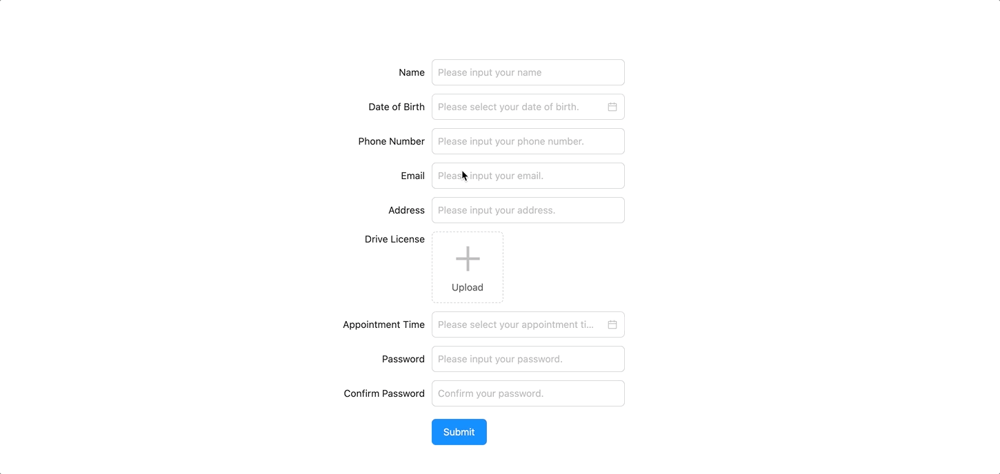
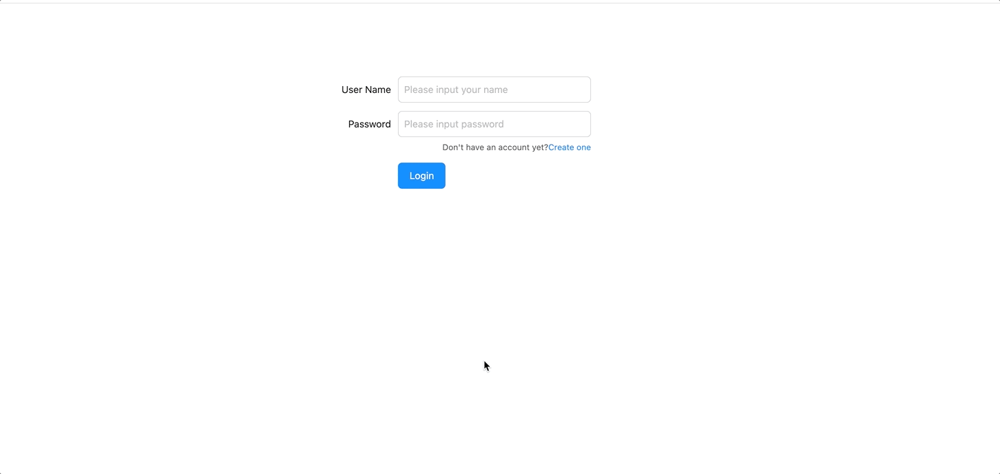

# umi project

## 启动

node > 16

Install dependencies,

```bash
$ yarn
```

Start the dev server,

```bash
$ yarn start
```

## 预览






## 项目大致结构


```
├── assets
│   ├── delete.svg
│   ├── logo.svg
│   └── picture.svg
├── components
│   ├── FormItem
│   │   ├── FormItem.js
│   │   └── form.less
│   └── index.js
├── global.less
├── models
│   └── index.js
├── pages
│   ├── Dashboard
│   │   ├── index.js
│   │   └── index.less
│   ├── Login
│   │   ├── index.js
│   │   └── index.less
│   └── Registration
│       ├── index.js
│       └── index.less
├── services
│   └── index.js
└── utils.js
```

assets中存放一些资源，例如图片，svg等；

页面都存在于pages目录下;

components中存放必要的组件;

models中存放redux的model;

services中存放服务;


## 物料库
antd，lodash，moment


## 功能

### 登录

路由：/login

对表单只做了简单的必填的校验，密码采用非对称加密，publickKey使用mock数据


### 注册

路由：/regist

名称、地址、出生日期、appointment time、photo仅设置必填校验；手机号码仅校验13位长度；邮箱做格式校验

### dashboard

路由：/dashboard

admin用户进来后默认查询用户列表并进行展示

## 打包

npm run build

| File        | Size   | Gzipped  |
| ----------- | ------ | -------- |
| dist/umi.js | 1.4 MB | 440.0 KB |
|dist/umi.css  |    237.9 KB        |            29.3 KB|